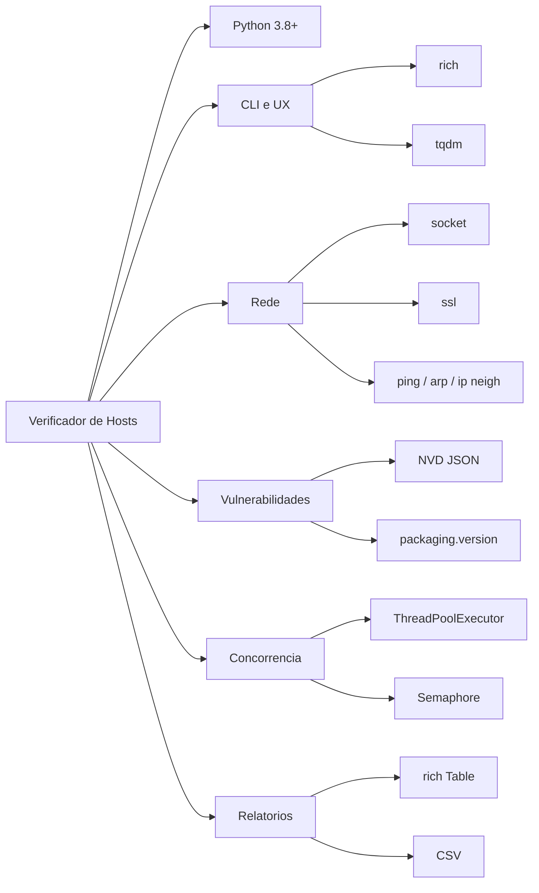
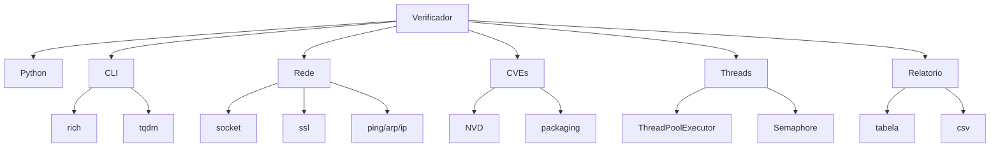

# 🚀 Verificador de Hosts com Auditoria de Segurança

Projeto de auditoria de rede local via terminal, com recursos completos de varredura e análise de vulnerabilidades.

---
## 🧰 Tecnologias & Linguagens

<!-- Badges do stack -->

<p align="left">
  
  
  
  
  
  
  
  
  
  
</p>

<!-- Gráfico Mermaid (compatível com GitHub) -->



<!-- Versão alternativa "safe" (se seu renderer não suportar alguns caracteres) -->




##  Funcionalidades

- **Ping + TTL** → Identificação de sistema operacional (Linux/Windows/Cisco)
- **Hostname reverso (DNS)**
- **MAC e fabricante** via OUI (offline, usando `manuf`)
- **Scan de portas comuns** com banner grabbing
- **Detecção de vulnerabilidades (CVEs)** baseado em banners e base local da NVD
- **Relatório visual colorido** no terminal com `rich`, destacando portas críticas e latência
- **Exportação para CSV** com delimitador `;`

---

##  Estrutura do Projeto

```
verificador_hosts/
├── __main__.py              # Script principal de execução
├── scan.py                  # Lógica de varredura de hosts e portas
├── utils.py                 # Auxiliares para entrada e tabela OUI
├── cve.py                   # Processamento e verificação de CVEs via NVD
├── atualizar_nvd.py         # Atualização da base NVD local (.json.gz + cache)
├── relatorio.py             # Exibição e exportação dos dados
├── config.py                # Auto-configuração de threads e timeout
├── requirements.txt         # Dependências do projeto
├── .gitignore               # Itens ignorados pelo Git
├── manuf                    # Arquivo OUI (Wireshark/Nmap) com fabricantes
└── nvd_data/                # Arquivos NVD baixados (ignorado no Git)
```

---

##  Instalação e Execução

1. Clone o repositório:

   ```bash
   git clone https://github.com/anxiousCamel/verificador_hosts
   cd verificador_hosts
   ```

2. (Opcional) Configure ambiente virtual:

   ```bash
   python -m venv .venv
   source .venv/bin/activate  # Linux/macOS
   .venv\Scripts\activate     # Windows
   ```

3. Instale as dependências:

   ```bash
   pip install -r requirements.txt
   ```

4. Execute o programa principal:

   ```bash
   python __main__.py
   ```

---

##  Atualizando a base CVE (NVD)

Para baixar ou atualizar a base local de vulnerabilidades (JSON .gz da NVD):

```bash
python atualizar_nvd.py
# Ou usar o comando principal, que verifica automaticamente e atualiza se necessário
python __main__.py
```

A base será salva em `nvd_data/` e usada para consulta local de CVEs.

---

##  Exportação de Relatórios

Ao final da varredura, você pode exportar os resultados em CSV com delimitador `;`.

Campos incluídos:

- IP, Status, Hostname, MAC, Fabricante, Sistema Operacional, Portas, Banners, Vulnerabilidades, Latência (ms)

---

##  Observações Importantes

- A detecção de CVEs depende da correspondência textual entre banners e descrições — pode haver inconsistência ou falsos negativos.
- Firewall ou filtros de rede podem impedir o banner grabbing ou ping.
- Repositório configurado para evitar versionamento de grandes dados locais (`nvd_data/`) e caches (`__pycache__`, `.pyc`).

---

##  Autor

Luiz Vinicius Belmont — Desenvolvedor e Infraestruturista

---

##  Licença

Uso interno e educacional. Consulte o autor para distribuição ou adaptação.
