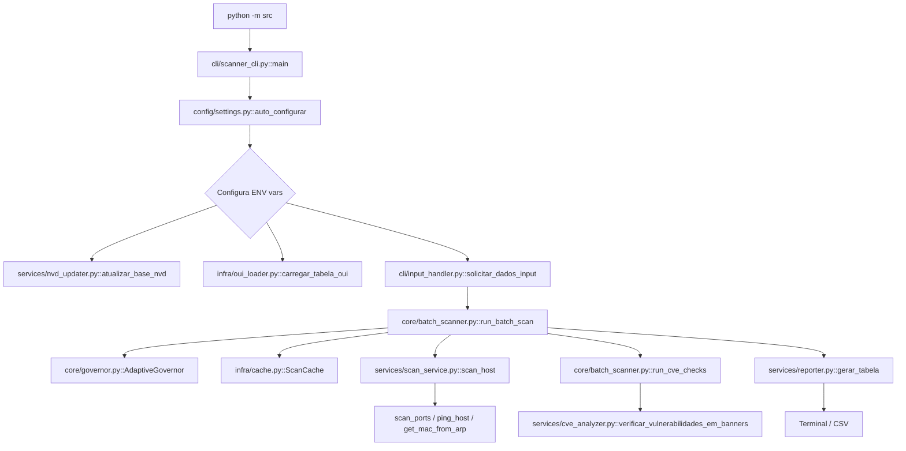
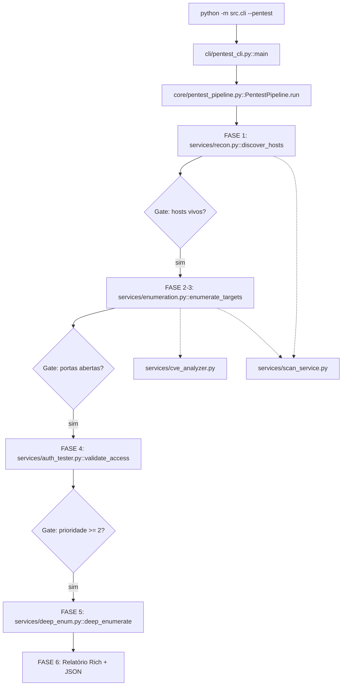

# Arquitetura — Verificador de Hosts com Auditoria de Segurança

## Visão Geral

O projeto oferece dois modos de operação que compartilham a mesma base de serviços:

| Modo | Comando | Descrição |
|---|---|---|
| **Scanner simples** | `python -m src` | Varredura em lotes com cache, governança adaptativa e relatório CSV |
| **Pipeline de pentest** | `python -m src.cli --pentest` | Pipeline de 6 fases com decision gates e achados estruturados |

---

## Estrutura de Diretórios

```
src/
├── __init__.py
├── __main__.py              ← python -m src (scanner simples)
│
├── cli/                     ← Camada de entrada
│   ├── __main__.py          ← python -m src.cli (dispatcher)
│   ├── scanner_cli.py       ← main() do scanner simples
│   ├── pentest_cli.py       ← main() do pipeline pentest
│   └── input_handler.py     ← solicitar_dados_input()
│
├── core/                    ← Orquestração
│   ├── governor.py          ← AdaptiveGovernor (ajuste dinâmico de parâmetros)
│   ├── batch_scanner.py     ← run_batch_scan() (lotes + cache + governança)
│   └── pentest_pipeline.py  ← PentestPipeline (6 fases com decision gates)
│
├── services/                ← Regras de negócio
│   ├── scan_service.py      ← ping, port scan, banner grabbing, MAC, OUI
│   ├── cve_analyzer.py      ← matching CPE/NVD, índice pickle, semver
│   ├── nvd_updater.py       ← download feeds NVD com retry/backoff
│   ├── reporter.py          ← tabela Rich colorida + exportação CSV
│   ├── recon.py             ← Fase 1: discovery paralelo + triagem por TTL
│   ├── enumeration.py       ← Fase 2-3: port scan direcionado + análise
│   ├── auth_tester.py       ← Fase 4: credenciais padrão + acesso anônimo
│   └── deep_enum.py         ← Fase 5: shares SMB + headers HTTP
│
├── infra/                   ← Infraestrutura (I/O de baixo nível)
│   ├── cache.py             ← ScanCache (JSON + TTL por entrada)
│   └── oui_loader.py        ← carregar_tabela_oui() (formato Wireshark)
│
├── models/                  ← Estruturas de dados (puras)
│   └── pentest_models.py    ← HostTarget, PortInfo, Finding, PentestReport
│
└── config/                  ← Configuração
    └── settings.py          ← auto_configurar() (presets + ENV + clamps)
```

---

## Camadas e Responsabilidades

### `cli/` — Entrada do sistema
- **Única camada** que faz I/O com o usuário (input(), print(), tqdm)
- Configura ENV vars antes de qualquer import de `scan_service`
- Não contém lógica de negócio — apenas orquestra chamadas ao `core`

### `core/` — Orquestração
- Sabe **em qual ordem** chamar os services e como reagir aos resultados
- `governor.py`: Ajusta dinamicamente batch/workers/timeout com base em métricas de performance
- `batch_scanner.py`: Loop de lotes com cache, spinner e governança adaptativa
- `pentest_pipeline.py`: Pipeline de 6 fases com decision gates entre cada fase
- **Não contém** lógica de rede ou análise de segurança

### `services/` — Regras de negócio
- Cada arquivo tem **responsabilidade única** e bem definida
- `scan_service.py`: Tudo relacionado a conectividade de rede (ping, sockets, banners)
- `cve_analyzer.py`: Tudo relacionado a NVD/CPE (parsing, indexação, matching)
- `reporter.py`: Tudo relacionado a apresentação de resultados
- Não fazem I/O com usuário e não conhecem o `core`

### `infra/` — Infraestrutura
- I/O de disco e dados externos sem lógica de negócio
- `cache.py`: Persistência atômica de resultados com TTL
- `oui_loader.py`: Carregamento da tabela de fabricantes IEEE
- Não importa nada do projeto

### `models/` — Estruturas de dados
- Dataclasses puras que fluem entre as fases do pipeline
- Sem dependências de projeto, sem lógica de rede
- `HostTarget` acumula informações progressivamente por fase

### `config/` — Configuração
- `settings.py`: Lê ENV vars, aplica presets por modo/SO, aplica clamps rígidos
- Sem dependências de projeto (apenas stdlib)

---

## Regras de Acoplamento

```
cli → core, infra, config, services (reporter, nvd_updater)
core → services, models, infra, config
services → infra, models, config
infra → (nada do projeto)
models → (nada do projeto)
config → (nada do projeto)
```

**Proibido:**
- `infra` importar `services` ou `core`
- `models` importar qualquer camada do projeto
- `services` importar `core` ou `cli`
- `config` importar qualquer outra camada do projeto

---

## Fluxo: Scanner Simples



---

## Fluxo: Pipeline de Pentest



---

## Fluxo de Dados no Pipeline de Pentest

```
ip_list
   │
   ▼
[Fase 1 - Recon]
HostTarget(ip, ttl, latency, os_guess, priority=1|2|3)
   │
   ▼ Gate: apenas vivos
[Fase 2 - Enumeração]
HostTarget + open_ports=[PortInfo(port, service, version, banner)]
   │
   ▼ (integrado)
[Fase 3 - Análise]
HostTarget + findings=[Finding(severity, title, cve_ids)]
   │
   ▼ Gate: prioridade >= 2
[Fase 4 - Auth]
HostTarget + auth_results=[{service, method, success}]
   │
   ▼ Gate: acesso confirmado
[Fase 5 - Deep Enum]
HostTarget + smb_shares, http_paths
   │
   ▼
[Fase 6 - Relatório]
PentestReport → terminal + pentest_report.json
```

---

## Convenção de Nomenclatura

| Padrão | Exemplo |
|---|---|
| Módulo = função principal do arquivo | `scan_service.py` → `scan_host()` |
| Serviços com sufixo `_service` ou `_analyzer` | `scan_service`, `cve_analyzer` |
| Funções privadas com `_` | `_scan_single_port`, `_build_ping_args` |
| Constantes em UPPER_SNAKE | `CRITICAL_PORTS`, `DEFAULT_SCAN_PORTS` |
| Classes em PascalCase | `AdaptiveGovernor`, `ScanCache`, `PentestPipeline` |

---

## Como Executar

```bash
# Scanner simples (padrão)
python -m src

# Pipeline de pentest
python -m src.cli --pentest

# Só o pentest CLI diretamente
python -m src.cli.pentest_cli

# Com variáveis de ambiente
VH_MODE=leve VH_SKIP_CVE=1 python -m src
VH_MODE=completo python -m src.cli --pentest
```

---

## Variáveis de Ambiente

| Variável | Valores | Descrição |
|---|---|---|
| `VH_MODE` | `auto`\|`leve`\|`completo` | Preset base de configuração |
| `VH_ASK_MODE` | `0`\|`1` | Perguntar modo interativamente |
| `VH_MAX_HOSTS_WORKERS` | 4-12 | Threads para scan de hosts |
| `VH_MAX_PORTS_WORKERS` | 2-6 | Threads para port scan por host |
| `VH_TIMEOUT_SOCKET` | 1.5-5.0 | Timeout de conexão em segundos |
| `VH_MAX_SOCKETS` | 64-160 | Limite global de sockets simultâneos |
| `VH_BATCH_SIZE` | 6-16 | Tamanho do lote de IPs |
| `VH_RESOLVE_HOSTNAME` | `0`\|`1` | Resolver DNS reverso |
| `VH_TCP_ONLY` | `0`\|`1` | Usar apenas TCP |
| `VH_SKIP_CVE` | `0`\|`1` | Pular verificação de CVEs |
| `VH_SKIP_NVD_UPDATE` | `0`\|`1` | Pular atualização da base NVD |
| `VH_CACHE_TTL_MINUTES` | inteiro | TTL do cache em minutos (padrão: 30) |
| `NVD_DIR` | caminho | Diretório dos JSONs NVD (padrão: `nvd_data`) |
| `NVD_INDEX_MAX_YEARS` | inteiro | Anos recentes a indexar (padrão: 5) |
